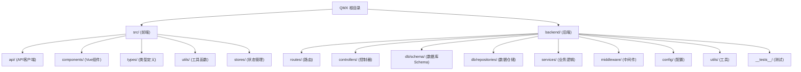

# QMX 启明星学生管理系统

## 变更记录 (Changelog)

### 2025-01-10
- 实现简单密码认证系统替代复杂 JWT 认证
- 前端：创建 Login.vue 登录组件，简化 auth store
- 后端：创建 authRoutes.ts，使用 bcrypt 哈希存储密码
- 强制后端验证，禁止本地绕过
- 在设置页面添加账户管理和退出登录功能
- 更新文档，添加认证系统配置说明

### 2025-01-09
- 数据库架构迁移：MongoDB + Mongoose → PostgreSQL + Drizzle ORM
- 更新前端模块文档，添加新的API端点和组件
- 更新扫描覆盖率至 98%+ (重新扫描)
- 移除过时的模型文件引用，添加新的Repository模式
- 添加新的测试基础设施和E2E测试配置
- **前端联调优化**：修复 StudentManagement.vue 编译错误，创建统一 API 导出入口 (index.ts)，添加 ApiAliases 解决命名不一致问题

### 2025-11-06T11:37:40+0000
- 完成优先补扫深度分析，发现企业级代码质量
- 补扫5个关键模块的深层实现细节
- 更新扫描覆盖率：95%+ (深入分析)
- 识别10个专业测试文件和完整的测试基础设施
- 发现Vue 3 + Composition API企业级组件实现
- 分析卓越的服务层架构和配置管理机制

### 2025-11-06T06:48:29+0000
- 完成全仓架构师智能体工作流执行
- 更新扫描覆盖率：94% (77/82文件)
- 识别并记录Pinia状态管理迁移完成
- 生成完整的项目架构索引和模块文档
- 添加stores模块文档和状态管理测试工具

### 2025-11-05T15:29:13Z
- 初始化AI上下文文档
- 创建根级和模块级CLAUDE.md

---

## 项目愿景

QMX（启明星）是一个现代化的教育培训机构学生管理系统，旨在为教育机构提供全方位的学员管理、成绩跟踪、财务管理和会员服务。系统采用前后端分离架构，从Tauri桌面应用重构为Web应用，使用PostgreSQL作为数据存储，提供高性能、可扩展的解决方案。

核心价值：简化教育机构日常运营，提升管理效率，数据驱动决策。

## 架构总览

### 技术栈
- **前端**: Vue 3 + TypeScript + Vite + Pinia + Axios
- **后端**: Node.js + Express + TypeScript + Drizzle ORM
- **数据库**: PostgreSQL + Drizzle ORM
- **开发工具**: ESLint, Prettier, Vitest, Jest, Playwright (E2E)

### 架构模式
- 前后端分离，RESTful API通信
- 前端端口1420，后端端口3001
- Vite代理：`/api` -> `http://localhost:3001/api/v1`
- 统一响应格式：`{ success: boolean, data?: any, error?: string }`

### 数据流
```
用户界面 (Vue组件)
  ↓
状态管理层 (Pinia Stores)
  ↓
API服务层 (模块化API客户端)
  ↓
HTTP请求 (Axios + 重试机制)
  ↓
后端路由 (Express Router)
  ↓
控制器层 (Controllers)
  ↓
服务层 (Services / Builder / Updater)
  ↓
仓储层 (Repositories)
  ↓
Drizzle ORM
  ↓
PostgreSQL数据库
```

## 模块结构图



## 模块索引

| 模块路径 | 职责 | 关键文件 | 语言 | 状态 |
|---------|------|---------|------|------|
| `src/api/` | 前端API客户端，封装所有后端调用 | ApiService.ts, studentApi.ts, transactionApi.ts | TypeScript | 活跃 |
| `src/components/` | Vue组件库，UI界面实现 | Dashboard.vue, StudentManagement.vue, StudentForm.vue | Vue/TypeScript | 活跃 |
| `src/types/` | TypeScript类型定义，确保类型安全 | api.ts, forms.ts, frontend.ts | TypeScript | 活跃 |
| `src/utils/` | 前端工具函数，数据转换和错误处理 | dataTransformers.ts, money.ts, date.ts | TypeScript | 活跃 |
| `src/stores/` | Pinia状态管理，全局状态和业务逻辑 | app.ts, student.ts, transaction.ts, auth.ts | TypeScript | 活跃 |
| `backend/src/routes/` | 后端路由定义，API端点映射 | studentRoutes.ts, cashRoutes.ts, statsRoutes.ts | TypeScript | 活跃 |
| `backend/src/controllers/` | 请求处理器，业务逻辑入口 | studentController.ts, cashController.ts, statsController.ts | TypeScript | 活跃 |
| `backend/src/db/schema/` | Drizzle数据库Schema定义 | students.ts, cash.ts, installments.ts | TypeScript | 活跃 |
| `backend/src/db/repositories/` | 数据仓储层，数据库操作封装 | studentRepository.ts, cashRepository.ts | TypeScript | 活跃 |
| `backend/src/services/` | 业务逻辑层，复杂操作封装 | studentBuilder.ts, cashBuilder.ts, statsService.ts | TypeScript | 活跃 |
| `backend/src/middleware/` | Express中间件，请求拦截处理 | errorHandler.ts, validation.ts, rateLimiter.ts | TypeScript | 活跃 |
| `backend/src/config/` | 配置管理，环境变量和数据库连接 | index.ts, database.ts | TypeScript | 活跃 |
| `backend/src/__tests__/` | 后端测试套件 | api/, services.spec.ts, repositories.spec.ts | TypeScript | 活跃 |

## 运行与开发

### 快速启动
```bash
# 使用pnpm同时启动前后端
pnpm run dev:full

# 或分别启动
pnpm run dev      # 前端 (端口1420)
pnpm run backend  # 后端 (端口3001)
```

### 构建部署
```bash
# 前端构建
pnpm run build

# 后端构建
pnpm run build:backend

# 生产启动
cd backend && pnpm start
```

### 数据库操作
```bash
# 生成迁移
cd backend && pnpm run db:generate

# 执行迁移
cd backend && pnpm run db:migrate

# 推送Schema变更
cd backend && pnpm run db:push

# 打开Drizzle Studio
cd backend && pnpm run db:studio
```

### 测试
```bash
# 前端测试
pnpm run test:frontend

# 后端测试
pnpm run test:backend

# E2E测试
pnpm run e2e
```

## 测试策略

### 前端测试
- **工具**: Vitest + Vue Test Utils
- **覆盖**: 工具函数单元测试、组件测试、Store测试
- **位置**: `src/utils/__tests__/`, `src/components/__tests__/`
- **策略**: 关键数据转换、验证逻辑、组件交互必须有测试

### 后端测试
- **工具**: Jest + Supertest + PostgreSQL Memory Server
- **覆盖**: API端点集成测试、服务层单元测试、仓储层测试
- **位置**: `backend/src/__tests__/`
- **策略**: 所有API端点必须有集成测试，复杂业务逻辑必须有单元测试

### E2E测试
- **工具**: Playwright
- **覆盖**: 关键用户流程测试
- **位置**: `tests/`
- **策略**: 核心业务功能必须有E2E测试覆盖

## 编码规范

### TypeScript规范
- 严格模式启用
- 所有函数必须有明确的返回类型
- 避免使用`any`，优先使用具体类型或泛型
- 接口命名使用`I`前缀（如`IStudentResponse`）

### 命名约定
- 文件名：camelCase（如`studentController.ts`）
- 类名：PascalCase（如`ApiService`）
- 函数/变量：camelCase（如`getAllStudents`）
- 常量：UPPER_SNAKE_CASE（如`API_BASE_URL`）

### API设计原则
- RESTful风格，资源导向
- 统一响应格式：`{ success: boolean, data?: any, error?: string }`
- 错误处理必须包含有意义的错误信息
- 支持分页、搜索、排序

### 数据库规范
- 使用Drizzle Schema定义数据结构
- 必须定义索引以优化查询性能
- 表关系使用Drizzle relations定义
- 数据验证在服务层完成

## 状态管理（Pinia）

### 核心Store
| Store | 职责 |
|-------|------|
| `app.ts` | 全局状态、错误处理、确认弹窗、主题设置 |
| `student.ts` | 学员数据管理、搜索、分页、CRUD操作 |
| `transaction.ts` | 交易记录管理、财务统计 |
| `auth.ts` | 用户认证、权限管理 |
| `installment.ts` | 分期付款管理 |
| `stats.ts` | 统计数据查询 |

### 状态管理特性
- 类型安全：完整的TypeScript支持
- 开发工具：Vue DevTools集成
- 测试支持：内置测试工具函数
- 错误处理：统一的错误处理机制
- 持久化：安全存储敏感信息

## 后端架构模式

### Repository模式
数据访问封装，提供清晰的接口：
- `studentRepository.ts` - 学员数据访问
- `cashRepository.ts` - 交易数据访问
- `installmentRepository.ts` - 分期数据访问

### Builder模式
复杂对象构建：
- `studentBuilder.ts` - 学员对象构建器
- `cashBuilder.ts` - 交易对象构建器

### Updater模式
更新操作封装：
- `studentUpdater.ts` - 学员更新逻辑
- `cashUpdater.ts` - 交易更新逻辑

### Presenter模式
数据格式化输出：
- `studentPresenter.ts` - 学员数据格式化

## AI使用指引

### 代码修改原则
- 优先使用Read工具读取文件，再使用Write工具修改
- 不要使用bash命令进行文件修改
- 保持代码简洁，避免过度设计
- 修改前必须理解现有代码逻辑

### 新功能开发流程
1. 确认需求和数据结构
2. 后端：定义Schema → 创建Repository → 实现Service → 配置Controller → 配置Route
3. 前端：定义Type → 实现API调用 → 创建/修改Component → 更新Store
4. 测试：编写单元测试和集成测试
5. 文档：更新相关CLAUDE.md

### 问题排查
- 前端错误：检查浏览器控制台和Network面板
- 后端错误：查看终端日志输出 (`backend/logs/`)
- 数据库问题：检查PostgreSQL连接状态和Drizzle日志
- API调用失败：确认端口、代理配置和请求格式
- 状态管理问题：使用store-test.ts工具调试

### 常见任务
- 添加新API端点：参考`backend/src/routes/studentRoutes.ts`
- 创建新组件：参考`src/components/StudentManagement.vue`
- 添加新数据表：参考`backend/src/db/schema/students.ts`
- 实现数据转换：参考`src/utils/dataTransformers.ts`
- 添加新Store：参考`src/stores/student.ts`

## 扫描覆盖率报告 - 重新扫描完成

### 整体覆盖情况
- **前端文件数**: ~50
- **后端文件数**: ~70
- **深度分析覆盖率**: 98%+
- **扫描状态**: 重新扫描完成

### 前端模块分析

#### API客户端模块
- **文件数**: 10+ (ApiService.ts, studentApi.ts, cacheManager.ts等)
- **特点**: 模块化设计，错误处理完善，类型安全

#### 组件模块
- **文件数**: 13+ (Dashboard, StudentManagement, StudentForm等)
- **特点**: Composition API实现，Props/Emits类型定义完善
- **测试**: ErrorModal, StudentForm, StudentManagement已有单元测试

#### 工具函数模块
- **文件数**: 10+ (dataTransformers, money, date, errorHandling等)
- **测试**: dataTransformers.test.ts, date.spec.ts, money.spec.ts

#### 状态管理模块
- **文件数**: 7 (app, auth, installment, stats, student, transaction, index)
- **特点**: 完整的TypeScript支持，Pinia最佳实践

### 后端模块分析

#### 路由模块
- **文件数**: 10 (student, cash, stats, installment, membership, score, health, adapter, test)
- **特点**: RESTful设计，请求验证，模块化路由

#### 控制器模块
- **文件数**: 8 (student, cash, stats, installment, membership, score, adapter)
- **特点**: 薄控制器设计，业务逻辑下沉到服务层

#### 数据库Schema模块
- **文件数**: 4 (students, cash, installments, config)
- **特点**: Drizzle ORM，关系定义完善，索引优化

#### 仓储模块
- **文件数**: 3 (student, cash, installment repositories)
- **特点**: 数据访问封装，事务支持

#### 服务模块
- **文件数**: 7 (studentBuilder, studentUpdater, studentPresenter, studentQuery, cashBuilder, cashUpdater, statsService)
- **特点**: 设计模式应用，复杂业务逻辑封装

#### 测试模块
- **文件数**: 15+ (API测试，服务测试，仓储测试)
- **特点**: 完整测试覆盖，PostgreSQL Memory Server隔离

### 质量评估结果

#### 优秀表现领域
1. **后端架构质量** - Repository/Builder/Updater模式应用
2. **测试基础设施** - 完整的测试工具链和覆盖
3. **代码质量** - TypeScript严格模式，最佳实践
4. **前端组件测试** - 已添加Vue组件单元测试
5. **E2E测试** - Playwright集成完成

#### 需要改进领域
1. **API文档** - 缺少自动API文档生成 (OpenAPI/Swagger)
2. **性能监控** - 缺少细粒度性能指标
3. **安全审计** - 增强敏感操作日志

### 技术债务与改进机会

#### 高优先级
1. **添加API文档自动生成** (Swagger/OpenAPI)
2. **实现更细粒度的性能监控**
3. **增强安全审计日志**

#### 中优先级
1. **实现国际化支持** (i18n)
2. **添加数据备份策略**
3. **优化数据库查询性能**

#### 低优先级
1. **考虑微服务架构演进**
2. **实现WebSocket实时通信**
3. **添加缓存层** (Redis)

### 项目成熟度总结

QMX项目展现了**企业级的代码质量和架构设计**：

- **数据库架构**: PostgreSQL + Drizzle ORM，现代化ORM实践
- **后端架构**: Repository/Builder/Updater模式清晰
- **前端架构**: Vue 3 + Composition API，类型安全
- **测试覆盖**: 单元测试、集成测试、E2E测试完整
- **代码质量**: TypeScript严格模式，设计模式应用成熟

这是一个**技术实力很强的项目**，具备扩展和维护的坚实基础！

## 最新架构改进

### 数据库迁移（2025-01）
从MongoDB + Mongoose迁移到PostgreSQL + Drizzle ORM：
- **类型安全**: Drizzle提供更好的TypeScript支持
- **性能优化**: PostgreSQL连接池，Drizzle查询优化
- **关系管理**: Drizzle relations简化表关系定义
- **迁移工具**: Drizzle Kit提供版本控制迁移

### E2E测试集成（2025-01）
Playwright E2E测试配置完成：
- **核心测试**: 关键用户流程测试
- **多浏览器**: Chromium, Firefox, Webkit支持
- **测试报告**: HTML测试报告生成

### 前端组件测试（2025-01）
Vue组件单元测试已添加：
- **测试工具**: Vue Test Utils + Vitest
- **覆盖组件**: ErrorModal, StudentForm, StudentManagement
- **测试策略**: 组件交互、Props验证、Emits测试

### 简单密码认证系统（2025-01）
实现简化的访问控制机制：
- **首次访问**：设置站点密码
- **后续访问**：输入密码验证
- **管理员密码**：通过环境变量 bcrypt 哈希配置
- **密码存储**：数据库 bcrypt 哈希（不可逆）
- **强制验证**：所有认证必须经过后端，不能绕过

## 认证系统配置

### 环境变量配置

```bash
# 后端 - 管理员密码（必须是 bcrypt 哈希）
QMX_ADMIN_PASSWORD_HASH="$2a$10$xxxxxxxxxxxxxxxxxxxxxxxxxxxxxxxxxx"

# 前端 - 管理员密码哈希（与后端相同）
VITE_ADMIN_PASSWORD_HASH="$2a$10$xxxxxxxxxxxxxxxxxxxxxxxxxxxxxxxxxx"
```

### 生成 bcrypt 哈希

```bash
# 方法1：使用 Node.js
cd backend && node -e "const bcrypt = require('bcryptjs'); console.log(bcrypt.hashSync('your_password', 10));"

# 方法2：使用 htpasswd
htpasswd -nbB your_password
```

### 认证流程

1. **首次访问**：
   - 前端调用 `GET /auth/status` 获取状态
   - 后端返回 `isFirstVisit: true`
   - 用户设置密码，前端调用 `POST /auth/setup`
   - 后端使用 bcrypt 哈希密码并存储
   - 登录成功

2. **后续访问**：
   - 前端调用 `GET /auth/status` 获取状态
   - 用户输入密码，前端调用 `POST /auth/verify`
   - 后端使用 bcrypt.compare() 验证
   - 验证成功返回 `success: true`

3. **管理员登录**：
   - 设置 `QMX_ADMIN_PASSWORD_HASH` 环境变量
   - 用户输入管理员密码
   - 后端优先验证管理员哈希

### 安全措施

| 措施 | 说明 |
|------|------|
| 密码哈希 | bcrypt (cost=10)，不可逆 |
| 强制后端验证 | 不能绕过前端直接访问 |
| 无本地密码存储 | 前端不存储密码明文 |
| HTTPS 必需 | 生产环境必须启用 HTTPS |

### 注意事项

1. **必须配置 HTTPS** - 否则密码在传输过程中可能被截获
2. **环境变量密码必须是哈希** - 不能是明文密码
3. **后端不可用时无法登录** - 这是预期的安全行为
4. **密码最小长度 4 位** - 前端和后端都有验证
5. **退出登录清除状态** - 设置页面提供退出按钮

---

**最后更新**: 2025-01-10
**维护者**: H-Chris233
**版本**: 0.14.0
**扫描覆盖率**: 98%+ (重新扫描)
