# QMX 启明星学生管理系统

## 变更记录 (Changelog)

### 2026-02-13
- **补全未挂载的统计路由** (Stats API)
  - 添加 4 个已实现但未挂载的统计端点路由：
    - `GET /stats/trends` - 趋势分析数据（周/月/季/年维度）
    - `GET /stats/course-distribution` - 课程分布统计
    - `GET /stats/score-distribution` - 成绩分布统计
    - `GET /stats/overdue-installments` - 逾期分期付款统计
  - 后端 statsController.ts: 添加 `@deprecated` 注释和运行时警告
  - 前端 statsApi.ts: 添加 4 个新 API 方法
  - 前端 ApiService.ts: 添加统一入口方法
  - Stats API 端点数量：6 → 10 个
- **TypeScript 类型修复**

### 2026-02-14
- **移除废弃 API**
  - 移除后端 `GET /stats/financial` 端点及控制器方法
  - 移除前端 `getFinancialStats()` 废弃方法
  - 统一使用 `getGlobalFinancialStats()` 作为财务统计 API
  - 更新前端 Store、缓存配置、类型定义和测试文件
  - Stats API 端点数量：10 → 9 个
- **补全前端表单验证**
  - 实现 `validateStudentForm()` - 学员表单完整验证（姓名、手机号、年龄、班级、科目等）
  - 实现 `validateTransactionForm()` - 交易表单完整验证（金额、分期参数等）
  - 添加通用验证器：`isValidPhone`、`isNonEmptyString`、`isValidNumber` 等
  - 添加快速验证辅助函数：`validateStudentName`、`validatePhone`、`validateAmount`
- **修复分期取消状态更新**
  - 修复 `cancelInstallment()` 取消分期后本地状态不更新问题
  - 取消成功后自动更新该计划下所有分期的状态为 `CANCELLED`

### 2026-02-13
- **补全未挂载的统计路由** (Stats API)
  - 修复 `InstallmentSearchParams.studentId` 类型定义（string → string | number）
  - 修复 `test-utils.ts` 中 `mountWithPinia` 返回类型兼容性问题
- **OpenAPI/Swagger API 文档自动生成**
  - 添加 `swagger-jsdoc` + `swagger-ui-express` + `joi-to-swagger` 依赖
  - 创建 `backend/src/config/swagger.ts` - OpenAPI 3.0.3 规范配置
  - 创建 `backend/src/utils/joiToSwagger.ts` - Joi Schema 转换工具
  - 修改 `backend/src/app.ts` - 集成 Swagger UI 中间件
  - 为所有路由添加 OpenAPI JSDoc 注释（共 37 个端点）：
    - Health: 3 个端点
    - Auth: 4 个端点
    - Students: 6 个端点
    - Scores: 6 个端点
    - Transactions: 7 个端点
    - Installments: 12 个端点
    - Membership: 6 个端点
    - Stats: 6 个端点
  - 访问方式：开发环境启动后访问 `http://localhost:3001/api-docs`
  - JSON 规范端点：`http://localhost:3001/api-docs.json`
  - YAML 规范端点：`http://localhost:3001/api-docs.yaml`
- **AI上下文重新扫描**
  - 完成全仓清点和模块优先扫描
  - 更新扫描覆盖率至 98%+ (190+ 源代码文件)
  - 确认所有12个模块的CLAUDE.md文档完整
  - 更新模块结构图添加tests/目录
  - 新增E2E测试基础设施文档覆盖

### 2026-02-12
- **前后端 API 规范统一**
  - 后端 statsController.ts: 响应字段统一为 snake_case 格式（保留 camelCase 兼容）
  - 前端 statsApi.ts: mapper 函数优先使用 snake_case 字段
  - 金额字段命名规范化：使用 `_cents` 后缀明确标注单位（分）
- **路由清理**
  - 移除冗余 `/dashboard` 路由挂载，统一使用 `/stats` 前缀
  - 更新 API 信息端点反映正确路由
- **废弃 API 标记**
  - `getFinancialStats()` 添加运行时警告，引导使用 `getGlobalFinancialStats()`

### 2026-01-10
- 补全文档：添加 backend/src/db/ 模块 CLAUDE.md
- 补全文档：添加 backend/src/utils/ 模块 CLAUDE.md
- 更新模块索引，添加数据库和工具模块
- 文档覆盖率提升至 100%

### 2025-01-10
- 实现简单密码认证系统替代复杂 JWT 认证
- 前端：创建 Login.vue 登录组件，简化 auth store
- 后端：创建 authRoutes.ts，使用 bcrypt 哈希存储密码
- 强制后端验证，禁止本地绕过
- 在设置页面添加账户管理和退出登录功能
- 更新文档，添加认证系统配置说明

### 2025-01-09
- 数据库架构迁移：MongoDB + Mongoose -> PostgreSQL + Drizzle ORM
- 更新前端模块文档，添加新的API端点和组件
- 更新扫描覆盖率至 98%+ (重新扫描)
- 移除过时的模型文件引用，添加新的Repository模式
- 添加新的测试基础设施和E2E测试配置
- **前端联调优化**：修复 StudentManagement.vue 编译错误，创建统一 API 导出入口 (index.ts)，添加 ApiAliases 解决命名不一致问题

### 2025-11-06T11:37:40+0000
- 完成优先补扫深度分析，发现企业级代码质量
- 补扫5个关键模块的深层实现细节
- 更新扫描覆盖率：95%+ (深入分析)
- 识别10个专业测试文件和完整的测试基础设施
- 发现Vue 3 + Composition API企业级组件实现
- 分析卓越的服务层架构和配置管理机制

### 2025-11-06T06:48:29+0000
- 完成全仓架构师智能体工作流执行
- 更新扫描覆盖率：94% (77/82文件)
- 识别并记录Pinia状态管理迁移完成
- 生成完整的项目架构索引和模块文档
- 添加stores模块文档和状态管理测试工具

### 2025-11-05T15:29:13Z
- 初始化AI上下文文档
- 创建根级和模块级CLAUDE.md

---

## 项目愿景

QMX（启明星）是一个现代化的教育培训机构学生管理系统，旨在为教育机构提供全方位的学员管理、成绩跟踪、财务管理和会员服务。系统采用前后端分离架构，从Tauri桌面应用重构为Web应用，使用PostgreSQL作为数据存储，提供高性能、可扩展的解决方案。

核心价值：简化教育机构日常运营，提升管理效率，数据驱动决策。

## 架构总览

### 技术栈
- **前端**: Vue 3 + TypeScript + Vite + Pinia + Axios
- **后端**: Node.js + Express + TypeScript + Drizzle ORM
- **数据库**: PostgreSQL + Drizzle ORM
- **开发工具**: ESLint, Prettier, Vitest, Jest, Playwright (E2E)

### 架构模式
- 前后端分离，RESTful API通信
- 前端端口1420，后端端口3001
- Vite代理：`/api` -> `http://localhost:3001/api/v1`
- 统一响应格式：`{ success: boolean, data?: any, error?: string }`

### 数据流
```
用户界面 (Vue组件)
  |
状态管理层 (Pinia Stores)
  |
API服务层 (模块化API客户端)
  |
HTTP请求 (Axios + 重试机制)
  |
后端路由 (Express Router)
  |
控制器层 (Controllers)
  |
服务层 (Services / Builder / Updater)
  |
仓储层 (Repositories)
  |
Drizzle ORM
  |
PostgreSQL数据库
```

## 模块结构图

```mermaid
graph TD
    A["QMX 根目录"] --> B["src/ (前端)"];
    A --> C["backend/ (后端)"];
    A --> D["tests/ (测试)"];

    B --> B1["api/ (API客户端)"];
    B --> B2["components/ (Vue组件)"];
    B --> B3["types/ (类型定义)"];
    B --> B4["utils/ (工具函数)"];
    B --> B5["stores/ (状态管理)"];

    C --> C1["routes/ (路由)"];
    C --> C2["controllers/ (控制器)"];
    C --> C3["db/schema/ (数据库Schema)"];
    C --> C4["db/repositories/ (数据仓储)"];
    C --> C5["services/ (业务逻辑)"];
    C --> C6["middleware/ (中间件)"];
    C --> C7["config/ (配置)"];
    C --> C8["utils/ (工具)"];
    C --> C9["__tests__/ (后端测试)"];

    D --> D1["e2e/ (端到端测试)"];
    D --> D2["factories/ (测试工厂)"];
    D --> D3["mocks/ (Mock数据)"];

    click B1 "./src/api/CLAUDE.md" "查看 API 模块文档"
    click B2 "./src/components/CLAUDE.md" "查看组件模块文档"
    click B3 "./src/types/CLAUDE.md" "查看类型模块文档"
    click B4 "./src/utils/CLAUDE.md" "查看前端工具模块文档"
    click B5 "./src/stores/CLAUDE.md" "查看状态管理模块文档"
    click C1 "./backend/src/routes/CLAUDE.md" "查看路由模块文档"
    click C2 "./backend/src/controllers/CLAUDE.md" "查看控制器模块文档"
    click C3 "./backend/src/db/CLAUDE.md" "查看数据库模块文档"
    click C5 "./backend/src/services/CLAUDE.md" "查看服务层模块文档"
    click C6 "./backend/src/middleware/CLAUDE.md" "查看中间件模块文档"
    click C7 "./backend/src/config/CLAUDE.md" "查看配置模块文档"
    click C8 "./backend/src/utils/CLAUDE.md" "查看后端工具模块文档"
```



## 模块索引

| 模块路径 | 职责 | 关键文件 | 语言 | 状态 |
|---------|------|---------|------|------|
| `src/api/` | 前端API客户端，封装所有后端调用 | index.ts, ApiService.ts, studentApi.ts | TypeScript | 活跃 |
| `src/components/` | Vue组件库，UI界面实现 | Dashboard.vue, StudentManagement.vue, Login.vue | Vue/TypeScript | 活跃 |
| `src/types/` | TypeScript类型定义，确保类型安全 | api.ts, forms.ts, frontend.ts | TypeScript | 活跃 |
| `src/utils/` | 前端工具函数，数据转换和错误处理 | dataTransformers.ts, money.ts, date.ts | TypeScript | 活跃 |
| `src/stores/` | Pinia状态管理，全局状态和业务逻辑 | app.ts, student.ts, auth.ts, transaction.ts | TypeScript | 活跃 |
| `backend/src/routes/` | 后端路由定义，API端点映射 | index.ts, studentRoutes.ts, authRoutes.ts | TypeScript | 活跃 |
| `backend/src/controllers/` | 请求处理器，业务逻辑入口 | studentController.ts, cashController.ts, statsController.ts | TypeScript | 活跃 |
| `backend/src/db/` | 数据库层，PostgreSQL + Drizzle ORM | index.ts, schema/, repositories/ | TypeScript | 活跃 |
| `backend/src/db/schema/` | Drizzle数据库Schema定义 | students.ts, cash.ts, installments.ts, config.ts | TypeScript | 活跃 |
| `backend/src/db/repositories/` | 数据仓储层，数据库操作封装 | studentRepository.ts, cashRepository.ts, installmentRepository.ts | TypeScript | 活跃 |
| `backend/src/services/` | 业务逻辑层，复杂操作封装 | studentBuilder.ts, studentQuery.ts, statsService.ts | TypeScript | 活跃 |
| `backend/src/middleware/` | Express中间件，请求拦截处理 | errorHandler.ts, validation.ts, rateLimiter.ts | TypeScript | 活跃 |
| `backend/src/config/` | 配置管理，环境变量和数据库连接 | index.ts, database.ts | TypeScript | 活跃 |
| `backend/src/utils/` | 后端工具函数，错误处理和日志 | errors.ts, logger.ts, money.ts, date.ts | TypeScript | 活跃 |
| `backend/src/__tests__/` | 后端测试套件 | api/, fixtures/, helpers/ | TypeScript | 活跃 |
| `tests/` | E2E测试和测试基础设施 | e2e/, factories/, mocks/, helpers/ | TypeScript | 活跃 |

## 运行与开发

### 快速启动
```bash
# 使用pnpm同时启动前后端
pnpm run dev:full

# 或分别启动
pnpm run dev      # 前端 (端口1420)
pnpm run backend  # 后端 (端口3001)
```

### 构建部署
```bash
# 前端构建
pnpm run build

# 后端构建
pnpm run build:backend

# 生产启动
cd backend && pnpm start
```

### 数据库操作
```bash
# 生成迁移
cd backend && pnpm run db:generate

# 执行迁移
cd backend && pnpm run db:migrate

# 推送Schema变更
cd backend && pnpm run db:push

# 打开Drizzle Studio
cd backend && pnpm run db:studio
```

### 测试
```bash
# 前端测试
pnpm run test:frontend

# 后端测试
pnpm run test:backend

# E2E测试
pnpm run e2e

# E2E核心测试
pnpm run e2e:core
```

## 测试策略

### 前端测试
- **工具**: Vitest + Vue Test Utils
- **覆盖**: 工具函数单元测试、组件测试、Store测试
- **位置**: `src/**/__tests__/`
- **策略**: 关键数据转换、验证逻辑、组件交互必须有测试

### 后端测试
- **工具**: Jest + Supertest
- **覆盖**: API端点集成测试、服务层单元测试、仓储层测试
- **位置**: `backend/src/__tests__/`
- **策略**: 所有API端点必须有集成测试，复杂业务逻辑必须有单元测试

### E2E测试
- **工具**: Playwright
- **覆盖**: 关键用户流程测试
- **位置**: `tests/e2e/`
- **策略**: 核心业务功能必须有E2E测试覆盖

### 测试基础设施
- **测试工厂**: `tests/factories/` - StudentFactory, TransactionFactory, InstallmentFactory, StatsFactory
- **Mock数据**: `tests/mocks/msw/` - MSW handlers
- **页面对象**: `tests/e2e/page-objects/` - Playwright页面对象模式
- **测试辅助**: `tests/helpers/` - assertions, mount, test-selectors

## 编码规范

### TypeScript规范
- 严格模式启用
- 所有函数必须有明确的返回类型
- 避免使用`any`，优先使用具体类型或泛型
- 接口命名使用`I`前缀（如`IStudentResponse`）

### 命名约定
- 文件名：camelCase（如`studentController.ts`）
- 类名：PascalCase（如`ApiService`）
- 函数/变量：camelCase（如`getAllStudents`）
- 常量：UPPER_SNAKE_CASE（如`API_BASE_URL`）
- 数据库字段：snake_case（如`student_id`）
- API响应：snake_case优先，保留camelCase兼容

### API设计原则
- RESTful风格，资源导向
- 统一响应格式：`{ success: boolean, data?: any, error?: string }`
- 错误处理必须包含有意义的错误信息
- 支持分页、搜索、排序

### 数据库规范
- 使用Drizzle Schema定义数据结构
- 必须定义索引以优化查询性能
- 表关系使用Drizzle relations定义
- 数据验证在服务层完成
- 金额存储单位：分（cents）

## 状态管理（Pinia）

### 核心Store
| Store | 职责 |
|-------|------|
| `app.ts` | 全局状态、错误处理、确认弹窗、主题设置 |
| `student.ts` | 学员数据管理、搜索、分页、CRUD操作 |
| `transaction.ts` | 交易记录管理、财务统计 |
| `auth.ts` | 用户认证、权限管理 |
| `installment.ts` | 分期付款管理 |
| `stats.ts` | 统计数据查询 |

### 状态管理特性
- 类型安全：完整的TypeScript支持
- 开发工具：Vue DevTools集成
- 测试支持：内置测试工具函数
- 错误处理：统一的错误处理机制
- 持久化：安全存储敏感信息

## 后端架构模式

### Repository模式
数据访问封装，提供清晰的接口：
- `studentRepository.ts` - 学员数据访问
- `cashRepository.ts` - 交易数据访问
- `installmentRepository.ts` - 分期数据访问

### Builder模式
复杂对象构建：
- `studentBuilder.ts` - 学员对象构建器
- `cashBuilder.ts` - 交易对象构建器

### Updater模式
更新操作封装：
- `studentUpdater.ts` - 学员更新逻辑
- `cashUpdater.ts` - 交易更新逻辑

### Query模式
复杂查询构建：
- `studentQuery.ts` - 学员查询构建器（流畅API）

### Presenter模式
数据格式化输出：
- `studentPresenter.ts` - 学员数据格式化

## AI使用指引

### 代码修改原则
- 优先使用Read工具读取文件，再使用Write工具修改
- 不要使用bash命令进行文件修改
- 保持代码简洁，避免过度设计
- 修改前必须理解现有代码逻辑

### 新功能开发流程
1. 确认需求和数据结构
2. 后端：定义Schema -> 创建Repository -> 实现Service -> 配置Controller -> 配置Route
3. 前端：定义Type -> 实现API调用 -> 创建/修改Component -> 更新Store
4. 测试：编写单元测试和集成测试
5. 文档：更新相关CLAUDE.md

### 问题排查
- 前端错误：检查浏览器控制台和Network面板
- 后端错误：查看终端日志输出 (`backend/logs/`)
- 数据库问题：检查PostgreSQL连接状态和Drizzle日志
- API调用失败：确认端口、代理配置和请求格式
- 状态管理问题：使用store-test.ts工具调试

### 常见任务
- 添加新API端点：参考`backend/src/routes/studentRoutes.ts`
- 创建新组件：参考`src/components/StudentManagement.vue`
- 添加新数据表：参考`backend/src/db/schema/students.ts`
- 实现数据转换：参考`src/utils/dataTransformers.ts`
- 添加新Store：参考`src/stores/student.ts`

## 扫描覆盖率报告

### 整体覆盖情况 (2026-02-13)
- **前端源文件**: ~70个（含组件、API、类型、工具、stores、测试）
- **后端源文件**: ~80个（含路由、控制器、服务、仓储、测试）
- **E2E测试文件**: ~40个（含页面对象、工厂、fixtures）
- **深度分析覆盖率**: 98%+
- **扫描状态**: 增量更新完成

### 前端模块分析

| 模块 | 文件数 | 测试覆盖 | 文档状态 |
|------|--------|----------|----------|
| src/api/ | 12 | 有 | 完整 |
| src/components/ | 15 | 有 | 完整 |
| src/stores/ | 7 | 有 | 完整 |
| src/types/ | 4 | - | 完整 |
| src/utils/ | 12 | 有 | 完整 |

### 后端模块分析

| 模块 | 文件数 | 测试覆盖 | 文档状态 |
|------|--------|----------|----------|
| backend/src/routes/ | 11 | 有 | 完整 |
| backend/src/controllers/ | 7 | 有 | 完整 |
| backend/src/db/ | 8 | 有 | 完整 |
| backend/src/services/ | 8 | 有 | 完整 |
| backend/src/middleware/ | 3 | 有 | 完整 |
| backend/src/config/ | 2 | - | 完整 |
| backend/src/utils/ | 6 | 有 | 完整 |
| backend/src/__tests__/ | 25+ | - | - |

### 测试基础设施

| 目录 | 文件数 | 职责 |
|------|--------|------|
| tests/e2e/ | 15+ | E2E测试用例和配置 |
| tests/factories/ | 6 | 测试数据工厂 |
| tests/mocks/ | 3 | MSW Mock处理器 |
| tests/helpers/ | 4 | 测试辅助函数 |
| tests/fixtures/ | 3 | 测试固定数据 |

### 质量评估结果

#### 优秀表现领域
1. **后端架构质量** - Repository/Builder/Updater/Query模式完善
2. **测试基础设施** - 完整的测试工具链和覆盖
3. **代码质量** - TypeScript严格模式，最佳实践
4. **前端组件测试** - Vue组件单元测试完善
5. **E2E测试** - Playwright集成完成，页面对象模式

#### 需要改进领域
1. **API文档** - 缺少自动API文档生成 (OpenAPI/Swagger)
2. **性能监控** - 缺少细粒度性能指标
3. **安全审计** - 增强敏感操作日志

### 技术债务与改进机会

#### 高优先级
1. ~~**添加API文档自动生成** (Swagger/OpenAPI)~~ ✅ 已完成 (2026-02-13)
2. **实现更细粒度的性能监控**
3. **增强安全审计日志**

#### 中优先级
1. **实现国际化支持** (i18n)
2. **添加数据备份策略**
3. **优化数据库查询性能**

#### 低优先级
1. **考虑微服务架构演进**
2. **实现WebSocket实时通信**
3. **添加缓存层** (Redis)

### 项目成熟度总结

QMX项目展现了**企业级的代码质量和架构设计**：

- **数据库架构**: PostgreSQL + Drizzle ORM，现代化ORM实践
- **后端架构**: Repository/Builder/Updater/Query模式清晰
- **前端架构**: Vue 3 + Composition API，类型安全
- **测试覆盖**: 单元测试、集成测试、E2E测试完整
- **代码质量**: TypeScript严格模式，设计模式应用成熟

这是一个**技术实力很强的项目**，具备扩展和维护的坚实基础！

## 最新架构改进

### 数据库迁移（2025-01）
从MongoDB + Mongoose迁移到PostgreSQL + Drizzle ORM：
- **类型安全**: Drizzle提供更好的TypeScript支持
- **性能优化**: PostgreSQL连接池，Drizzle查询优化
- **关系管理**: Drizzle relations简化表关系定义
- **迁移工具**: Drizzle Kit提供版本控制迁移

### E2E测试集成（2025-01）
Playwright E2E测试配置完成：
- **核心测试**: 关键用户流程测试
- **多浏览器**: Chromium, Firefox, Webkit支持
- **测试报告**: HTML测试报告生成

### 前端组件测试（2025-01）
Vue组件单元测试已添加：
- **测试工具**: Vue Test Utils + Vitest
- **覆盖组件**: ErrorModal, StudentForm, StudentManagement, Login, Dashboard等
- **测试策略**: 组件交互、Props验证、Emits测试

### 简单密码认证系统（2025-01）
实现简化的访问控制机制：
- **首次访问**：设置站点密码
- **后续访问**：输入密码验证
- **管理员密码**：通过环境变量 bcrypt 哈希配置
- **密码存储**：数据库 bcrypt 哈希（不可逆）
- **强制验证**：所有认证必须经过后端，不能绕过

## 认证系统配置

### 环境变量配置

```bash
# 后端 - 管理员密码（必须是 bcrypt 哈希）
QMX_ADMIN_PASSWORD_HASH="$2a$10$xxxxxxxxxxxxxxxxxxxxxxxxxxxxxxxxxx"

# 前端 - 管理员密码哈希（与后端相同）
VITE_ADMIN_PASSWORD_HASH="$2a$10$xxxxxxxxxxxxxxxxxxxxxxxxxxxxxxxxxx"
```

### 生成 bcrypt 哈希

```bash
# 方法1：使用 Node.js
cd backend && node -e "const bcrypt = require('bcryptjs'); console.log(bcrypt.hashSync('your_password', 10));"

# 方法2：使用 htpasswd
htpasswd -nbB your_password
```

### 认证流程

1. **首次访问**：
   - 前端调用 `GET /auth/status` 获取状态
   - 后端返回 `isFirstVisit: true`
   - 用户设置密码，前端调用 `POST /auth/setup`
   - 后端使用 bcrypt 哈希密码并存储
   - 登录成功

2. **后续访问**：
   - 前端调用 `GET /auth/status` 获取状态
   - 用户输入密码，前端调用 `POST /auth/verify`
   - 后端使用 bcrypt.compare() 验证
   - 验证成功返回 `success: true`

3. **管理员登录**：
   - 设置 `QMX_ADMIN_PASSWORD_HASH` 环境变量
   - 用户输入管理员密码
   - 后端优先验证管理员哈希

### 安全措施

| 措施 | 说明 |
|------|------|
| 密码哈希 | bcrypt (cost=10)，不可逆 |
| 强制后端验证 | 不能绕过前端直接访问 |
| 无本地密码存储 | 前端不存储密码明文 |
| HTTPS 必需 | 生产环境必须启用 HTTPS |

### 注意事项

1. **必须配置 HTTPS** - 否则密码在传输过程中可能被截获
2. **环境变量密码必须是哈希** - 不能是明文密码
3. **后端不可用时无法登录** - 这是预期的安全行为
4. **密码最小长度 4 位** - 前端和后端都有验证
5. **退出登录清除状态** - 设置页面提供退出按钮

---

**最后更新**: 2026-02-13
**维护者**: H-Chris233
**版本**: 0.15.0
**文档覆盖率**: 100% (所有模块已文档化)
