# QMX 启明星学生管理系统

## 变更记录 (Changelog)

### 2025-11-05T15:29:13Z
- 初始化AI上下文文档
- 创建根级和模块级CLAUDE.md
- 添加模块结构图和导航面包屑

---

## 项目愿景

QMX（启明星）是一个现代化的教育培训机构学生管理系统，旨在为教育机构提供全方位的学员管理、成绩跟踪、财务管理和会员服务。系统采用前后端分离架构，从Tauri桌面应用重构为Web应用，使用MongoDB作为数据存储，提供高性能、可扩展的解决方案。

核心价值：简化教育机构日常运营，提升管理效率，数据驱动决策。

## 架构总览

### 技术栈
- **前端**: Vue 3 + TypeScript + Vite
- **后端**: Node.js + Express + TypeScript + Mongoose
- **数据库**: MongoDB
- **开发工具**: ESLint, Prettier, Vitest, Jest

### 架构模式
- 前后端分离，RESTful API通信
- 前端端口1420，后端端口3001
- Vite代理：`/api` -> `http://localhost:3001/api/v1`
- 统一响应格式：`{ success: boolean, data?: any, error?: string }`

### 数据流
```
用户界面 (Vue组件)
  ↓
API服务层 (ApiService.ts)
  ↓
HTTP请求 (Axios + 重试机制)
  ↓
后端路由 (Express Router)
  ↓
控制器层 (Controllers)
  ↓
服务层 (Services)
  ↓
数据模型 (Mongoose Models)
  ↓
MongoDB数据库
```

## 模块结构图

```mermaid
graph TD
    A["QMX 根目录"] --> B["src/ (前端)"];
    A --> C["backend/ (后端)"];

    B --> B1["api/ (API客户端)"];
    B --> B2["components/ (Vue组件)"];
    B --> B3["types/ (类型定义)"];
    B --> B4["utils/ (工具函数)"];
    B --> B5["store/ (状态管理)"];

    C --> C1["routes/ (路由)"];
    C --> C2["controllers/ (控制器)"];
    C --> C3["models/ (数据模型)"];
    C --> C4["services/ (业务逻辑)"];
    C --> C5["middleware/ (中间件)"];
    C --> C6["config/ (配置)"];
    C --> C7["utils/ (工具)"];
    C --> C8["__tests__/ (测试)"];

    click B1 "./src/api/CLAUDE.md" "查看 API 模块文档"
    click B2 "./src/components/CLAUDE.md" "查看组件模块文档"
    click B3 "./src/types/CLAUDE.md" "查看类型模块文档"
    click B4 "./src/utils/CLAUDE.md" "查看前端工具模块文档"
    click C1 "./backend/src/routes/CLAUDE.md" "查看路由模块文档"
    click C2 "./backend/src/controllers/CLAUDE.md" "查看控制器模块文档"
    click C3 "./backend/src/models/CLAUDE.md" "查看模型模块文档"
    click C4 "./backend/src/services/CLAUDE.md" "查看服务模块文档"
    click C5 "./backend/src/middleware/CLAUDE.md" "查看中间件模块文档"
    click C6 "./backend/src/config/CLAUDE.md" "查看配置模块文档"
```



## 模块索引

| 模块路径 | 职责 | 关键文件 | 语言 |
|---------|------|---------|------|
| `src/api/` | 前端API客户端，封装所有后端调用 | ApiService.ts, baseClient.ts | TypeScript |
| `src/components/` | Vue组件库，UI界面实现 | MainApp.vue, Dashboard.vue, StudentManagement.vue | Vue/TypeScript |
| `src/types/` | TypeScript类型定义，确保类型安全 | api.ts, forms.ts, frontend.ts | TypeScript |
| `src/utils/` | 前端工具函数，数据转换和错误处理 | dataTransformers.ts, errorHandler.ts | TypeScript |
| `backend/src/routes/` | 后端路由定义，API端点映射 | index.ts, studentRoutes.ts, cashRoutes.ts | TypeScript |
| `backend/src/controllers/` | 请求处理器，业务逻辑入口 | studentController.ts, cashController.ts | TypeScript |
| `backend/src/models/` | Mongoose数据模型，数据库Schema | mongo.ts, CashMongo.ts, InstallmentMongo.ts | TypeScript |
| `backend/src/services/` | 业务逻辑层，复杂操作封装 | statsService.ts, studentQuery.ts | TypeScript |
| `backend/src/middleware/` | Express中间件，请求拦截处理 | errorHandler.ts, validation.ts, rateLimiter.ts | TypeScript |
| `backend/src/config/` | 配置管理，环境变量和数据库连接 | index.ts, mongodb.ts, database.ts | TypeScript |

## 运行与开发

### 快速启动
```bash
# 同时启动前后端
npm run dev:full

# 或分别启动
npm run dev      # 前端 (端口1420)
npm run backend  # 后端 (端口3001)
```

### 构建部署
```bash
# 前端构建
npm run build

# 后端构建
cd backend && npm run build

# 生产启动
cd backend && npm start
```

### 数据库初始化
```bash
cd backend
npm run seed  # 初始化数据库和示例数据
```

### 测试
```bash
# 前端测试
npm test

# 后端测试
cd backend && npm test
```

## 测试策略

### 前端测试
- 工具：Vitest
- 覆盖：工具函数单元测试 (`src/utils/__tests__/`)
- 策略：关键数据转换和验证逻辑必须有测试

### 后端测试
- 工具：Jest + Supertest + MongoDB Memory Server
- 覆盖：API端点集成测试、服务层单元测试
- 位置：`backend/src/__tests__/`
- 策略：所有API端点必须有集成测试，复杂业务逻辑必须有单元测试

## 编码规范

### TypeScript规范
- 严格模式启用
- 所有函数必须有明确的返回类型
- 避免使用`any`，优先使用具体类型或泛型
- 接口命名使用`I`前缀（如`IStudentDoc`）

### 命名约定
- 文件名：camelCase（如`studentController.ts`）
- 类名：PascalCase（如`ApiService`）
- 函数/变量：camelCase（如`getAllStudents`）
- 常量：UPPER_SNAKE_CASE（如`API_BASE_URL`）

### API设计原则
- RESTful风格，资源导向
- 统一响应格式
- 错误处理必须包含有意义的错误信息
- 支持分页、搜索、排序

### 数据库规范
- 使用Mongoose Schema定义数据结构
- 必须定义索引以优化查询性能
- 使用虚拟字段计算派生属性
- 数据验证在Schema层面完成

## AI使用指引

### 代码修改原则
- 优先使用Read工具读取文件，再使用Write工具修改
- 不要使用bash命令进行文件修改
- 保持代码简洁，避免过度设计
- 修改前必须理解现有代码逻辑

### 新功能开发流程
1. 确认需求和数据结构
2. 后端：定义Model → 创建Service → 实现Controller → 配置Route
3. 前端：定义Type → 实现API调用 → 创建/修改Component
4. 测试：编写单元测试和集成测试
5. 文档：更新相关CLAUDE.md

### 问题排查
- 前端错误：检查浏览器控制台和Network面板
- 后端错误：查看终端日志输出
- 数据库问题：检查MongoDB连接状态和数据完整性
- API调用失败：确认端口、代理配置和请求格式

### 常见任务
- 添加新API端点：参考`backend/src/routes/studentRoutes.ts`
- 创建新组件：参考`src/components/StudentManagement.vue`
- 添加新数据模型：参考`backend/src/models/mongo.ts`
- 实现数据转换：参考`src/utils/dataTransformers.ts`

---

**最后更新**: 2025-11-05T15:29:13Z
**维护者**: H-Chris233
**版本**: 0.12.1
